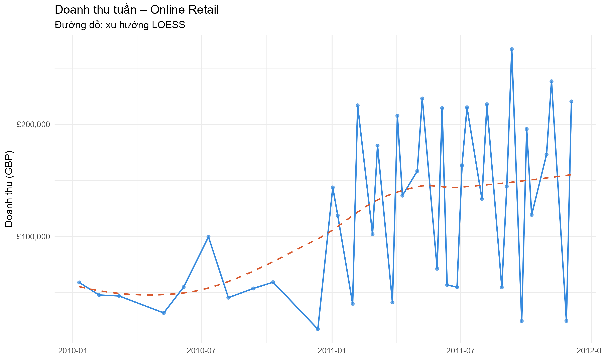
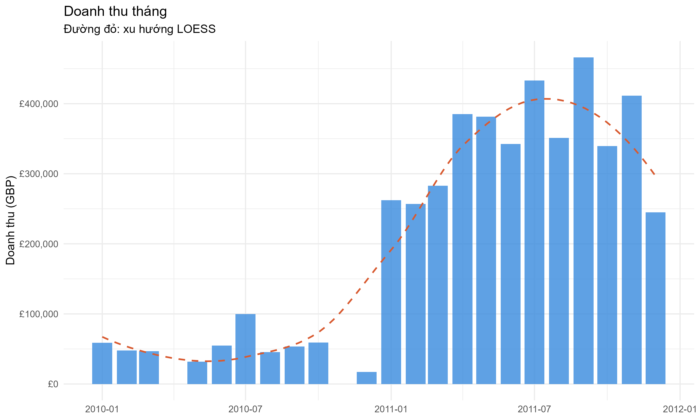
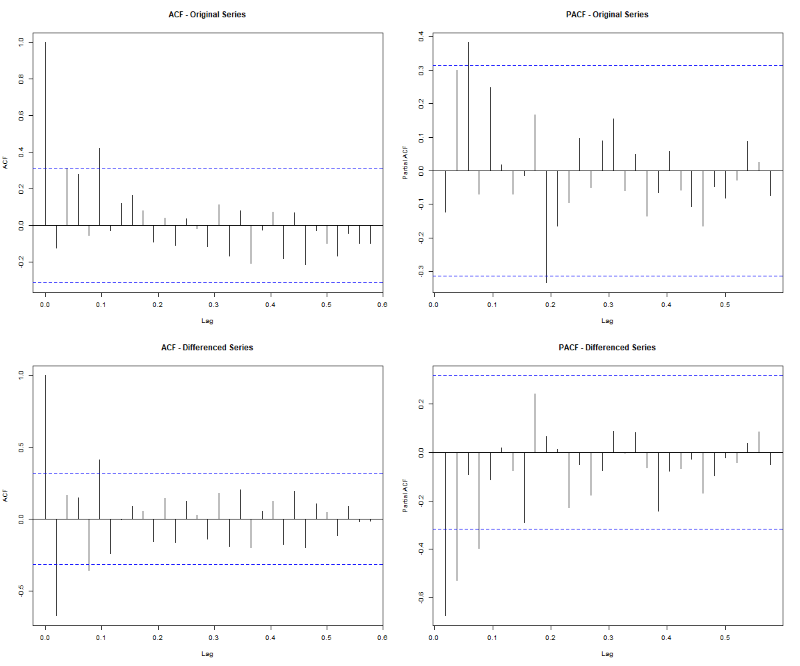
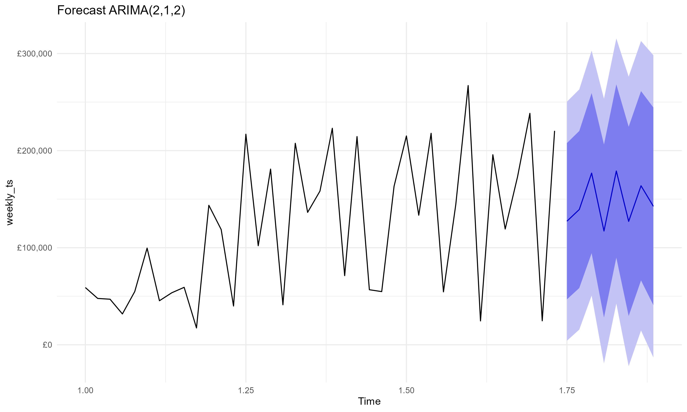
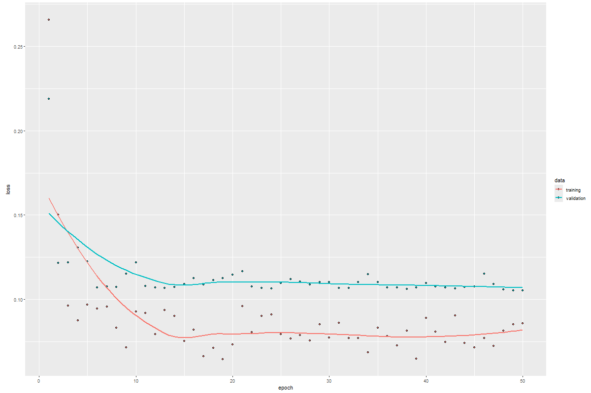
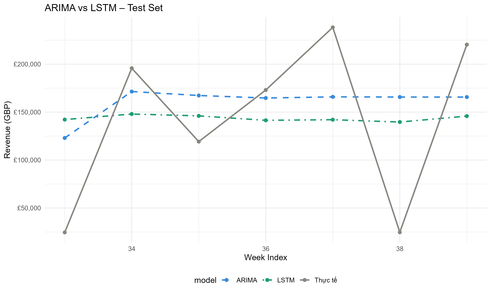
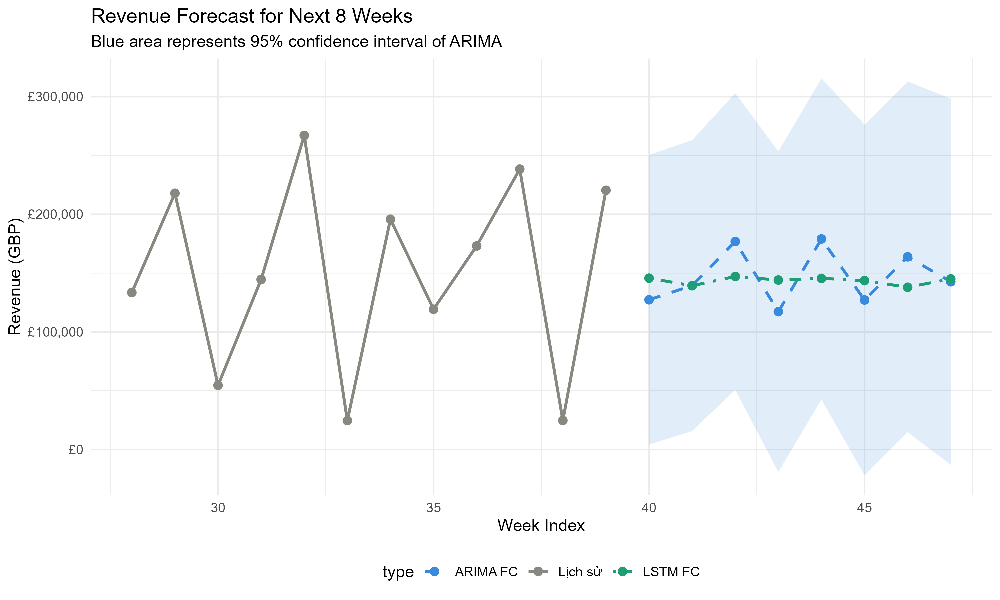

<div align="center">

# 📈 E-Commerce Revenue Forecasting
### ARIMA vs LSTM for Time Series Forecasting

Forecasting future e-commerce revenue using statistical modeling and deep learning.


</div>

---

# 🎯 Business Problem

E-commerce businesses must accurately forecast future revenue to support:

📦 Inventory Planning

💰 Marketing Budget Allocation

📊 Sales Target Setting

🚚 Operational Resource Planning

This project develops and compares two forecasting approaches:

| Model | Type |
|---------|---------|
| ARIMA | Statistical Forecasting |
| LSTM | Deep Learning Forecasting |

---

# 🏗 Project Pipeline

```text
Raw Transactions
       │
       ▼
Data Cleaning
       │
       ▼
Revenue Calculation
       │
       ▼
Weekly Aggregation
       │
       ▼
Exploratory Data Analysis
       │
       ▼
Stationarity Testing
       │
       ▼
 ┌──────────────┐
 │    ARIMA     │
 └──────────────┘
       │
       ▼
 ┌──────────────┐
 │     LSTM     │
 └──────────────┘
       │
       ▼
Model Evaluation
       │
       ▼
8-Week Revenue Forecast
```

---

# 📂 Dataset

### UCI Online Retail Dataset

| Attribute | Value |
|------------|------------|
| Transactions | 541,909 |
| Customers | 4,000+ |
| Period | Dec 2010 – Dec 2011 |
| Country | United Kingdom |
| Granularity | Transaction-Level |

Revenue formula:

```math
Revenue = Quantity \times UnitPrice
```

---

# 🔍 Exploratory Data Analysis

### Weekly Revenue Trend

<p align="center">

</p>

---

### Monthly Revenue Analysis

<p align="center">

</p>

---

# 📉 Stationarity Analysis

Before building ARIMA:

✅ Augmented Dickey-Fuller Test

✅ Differencing

✅ ACF Analysis

✅ PACF Analysis

<p align="center">

</p>

---

# 🤖 Model Development

## ARIMA

### Workflow

- Grid Search
- AIC Optimization
- Residual Diagnostics
- Ljung-Box Testing

Forecast:

<p align="center">

</p>

---

## LSTM

### Architecture

```text
Input Sequence
      │
      ▼
LSTM (64 units)
      │
 Dropout 0.2
      │
      ▼
LSTM (32 units)
      │
 Dropout 0.2
      │
      ▼
Dense Layer
      │
      ▼
Revenue Forecast
```

Learning Curve:

<p align="center">

</p>

---

# ⚔️ Model Comparison

<p align="center">

</p>

| Model | MAE | RMSE | MAPE |
|---------|---------:|---------:|---------:|
| ARIMA(2,1,2) | 63,914 | 76,347 | 154.96% |
| LSTM | 72,806 | 80,964 | 154.83% |

# Key Findings

- ARIMA achieved lower MAE and RMSE than LSTM.
- LSTM produced a slightly lower MAPE.
- Both models faced challenges due to the high volatility and limited length of the historical revenue series.
- ARIMA demonstrated stronger performance for this dataset despite its simpler statistical structure.

---

# 🔮 Revenue Forecast

Forecast horizon:

### Next 8 Weeks

<p align="center">

</p>

---

# 🛠 Technologies

### Data Processing

- readr
- dplyr
- lubridate

### Visualization

- ggplot2
- gridExtra

### Time Series

- forecast
- tseries

### Deep Learning

- TensorFlow
- Keras

### Reporting

- R Markdown

---

# 📁 Repository Structure

```text
ecommerce-revenue-forecasting
│
├── data
│   └── online_retail.csv
│
├── notebooks
│   └── ecommerce_timeseries.Rmd
│
├── images
│   ├── revenue_trend.png
│   ├── monthly_revenue.png
│   ├── stationarity_check.png
│   ├── arima_forecast.png
│   ├── lstm_learning_curve.png
│   ├── model_comparison.png
│   └── forecast_8weeks.png
│
├── reports
│   └── Ecommerce_Revenue_Forecasting.html
│
├── README.md
├── requirements.txt
└── .gitignore
```

---

# 💡 Key Takeaways

✅ Built an end-to-end forecasting pipeline

✅ Compared statistical and deep learning approaches

✅ Applied stationarity testing and model diagnostics

✅ Generated actionable business forecasts

✅ Automated report generation and visualization export

---

# 👨‍💻 Author

### Tran Nguyen Thanh Nam

Data Science Student

📌 Time Series Forecasting

📌 Machine Learning

📌 Deep Learning

📌 Business Analytics

🔗 GitHub: https://github.com/tntnammm

---
⭐ If you find this project interesting, feel free to star the repository.
